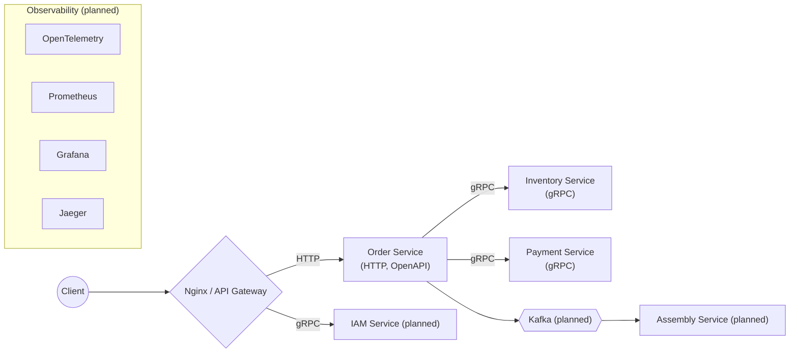

# LOMS (Logistics Order Management System)

Учебный микросервисный проект: система управления заказами на постройку космических кораблей и “складом” деталей.

Фокус:
- распределённые взаимодействия (HTTP + gRPC),
- контракт-ориентированная разработка (OpenAPI + Protobuf),
- базовая observability (в процессе).

## Архитектура (высокоуровнево)



## Репозиторий

Monorepo с `go.work` и модулями:
- `order/` — HTTP API (OpenAPI, сгенерировано `ogen`), оркестрация вызовов в `inventory` и `payment`.
- `inventory/` — gRPC API склада деталей.
- `payment/` — gRPC API оплаты (учебная заглушка).
- `shared/` — общие контракты и сгенерированный код:
  - `shared/api/order/v1/` — OpenAPI спецификация для `order`.
  - `shared/proto/` — protobuf контракты.
  - `shared/pkg/openapi/` — сгенерированный `ogen` сервер/типы для `order`.
  - `shared/pkg/proto/` — сгенерированный protobuf/gRPC код.

## Контракты / API

- **Order Service (HTTP/OpenAPI)**: `shared/api/order/v1/order.openapi.yaml`
- **Inventory Service (gRPC/Protobuf)**: `shared/proto/inventory/v1/inventory.proto`
- **Payment Service (gRPC/Protobuf)**: `shared/proto/payment/v1/payment.proto`

## Порты (локально)

- **Order HTTP**: `http://localhost:8080`
- **Inventory gRPC**: `localhost:50051`
- **Payment gRPC**: `localhost:50052`

## Требования

- Go **1.26.x** (в `Taskfile.yaml` и `go.work` указан 1.26.0; в корневом `go.mod` — 1.26.2).
- [`task`](https://taskfile.dev/) (Taskfile runner).

## Быстрый старт (локально)

Установить тулзы (линтеры, генераторы) в `./bin`:

```bash
task setup
```

Сгенерировать код из контрактов (protobuf + OpenAPI):

```bash
task gen
```

Запустить сервисы (в разных терминалах):

```bash
go run ./inventory/cmd
```

```bash
go run ./payment/cmd
```

```bash
go run ./order/cmd
```

Проверка, что `order` поднялся:
- `GET http://localhost:8080/api/v1/orders/{order_uuid}` — описано в OpenAPI спецификации.

## Разработка

Основные команды:

```bash
# форматирование
task format

# линт Go
task lint

# линт proto
task proto:lint

# генерация proto
task proto:gen

# генерация OpenAPI (ogen)
task ogen:gen

# тесты API (order/tests)
task test:api
```

## Статус (WIP)

- [x] Monorepo + `go.work`, базовая структура модулей.
- [x] Контракты: OpenAPI (`order`) и Protobuf (`inventory`, `payment`).
- [x] Генерация кода: `buf` + `ogen`.
- [x] Базовые тесты: `task test:api`.
- [ ] Kafka / события (запланировано).
- [ ] Инфраструктура (docker-compose, БД, observability стэк) — в планах, в репозитории пока не настроено.

